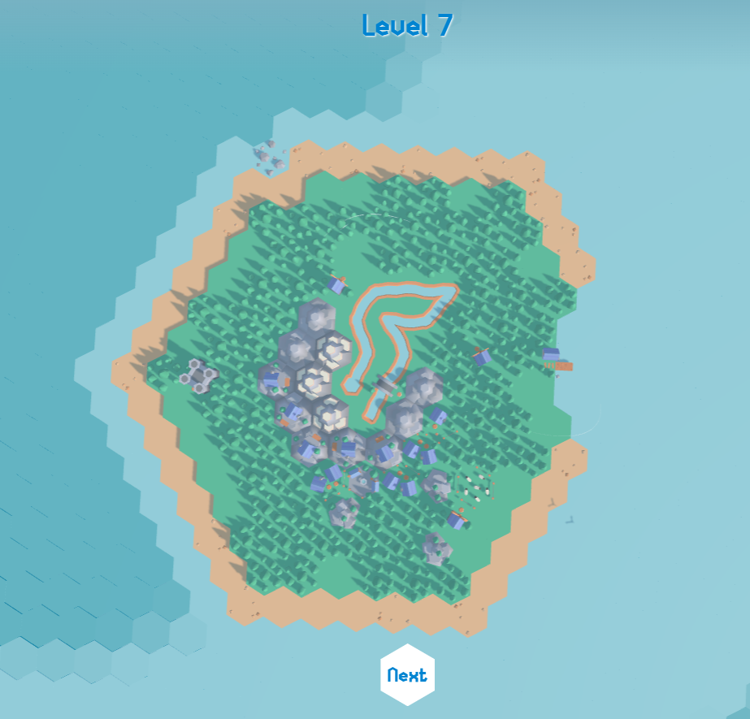

# 🏝️ PuzzleOasis

A stunning 3D puzzle game built with Three.js featuring hexagonal grid-based gameplay with interactive water physics and beautiful ocean environments.



## 🎮 About

PuzzleOasis is a web-based 3D puzzle game where players rotate hexagonal river tiles to restore water flow and bring life back to desert oases. The game features:

- **Hexagonal Grid Puzzles** - Rotate tiles to create connected water paths
- **Beautiful 3D Graphics** - Real-time WebGL rendering with custom shaders
- **Interactive Tutorial** - Step-by-step guidance for new players
- **Progressive Difficulty** - Multiple levels with increasing complexity
- **Cloud Save System** - Firebase integration for cross-device progress
- **Mobile Responsive** - Works on desktop and mobile devices

## 🚀 Quick Start

### Prerequisites

- [Node.js](https://nodejs.org/) (v14 or higher)
- npm or yarn package manager

### Installation

1. **Clone the repository**
   ```bash
   git clone <repository-url>
   cd PuzzleOasis
   ```

2. **Install dependencies**
   ```bash
   npm install
   ```

3. **Run development server**
   ```bash
   npm run dev
   ```

4. **Open in browser**
   ```
   Navigate to http://localhost:5173
   ```

### Production Build

```bash
# Build for production
npm run build

# Preview production build
npm run preview
```

## 🎯 How to Play

1. **Start the Game** - Click "Start" from the main menu
2. **Follow the Tutorial** - Learn to click/tap river tiles
3. **Rotate Tiles** - Click on tiles to rotate them
4. **Connect the River** - Create a continuous water path from source to oasis
5. **Complete Levels** - Restore water flow to progress to the next oasis

### Controls

- **Mouse** (Desktop):
  - Click tiles to rotate them
  - Drag to rotate camera
  - Scroll to zoom in/out
  
- **Touch** (Mobile):
  - Tap tiles to rotate them
  - Swipe to rotate camera
  - Pinch to zoom

- **Keyboard**:
  - `Escape` - Open menu

## 🛠️ Technology Stack

### Core Technologies
- **Three.js** v0.175.0 - 3D graphics engine
- **Vite** v6.0.11 - Build tool and dev server
- **JavaScript ES6+** - Modern JavaScript
- **GSAP** v3.12.7 - Animation library
- **Camera Controls** v2.10.0 - Camera management

### Styling & UI
- **Tailwind CSS** v4.0.9 - Utility-first CSS framework
- **FontAwesome** - Icon library
- **Custom GLSL Shaders** - Water and ocean effects

### Backend Services
- **Firebase** v11.10.0
  - Authentication
  - Cloud Firestore (state sync)
  - Cloud Storage

### Development Tools
- **Tweakpane** v4.0.5 - Debug GUI
- **Prettier** v3.4.2 - Code formatting
- **Sentry** v9.15.0 - Error tracking
- **vite-plugin-pwa** - Progressive Web App support

## 📁 Project Structure

```
PuzzleOasis/
├── src/
│   ├── config/              # Game configuration
│   │   ├── blocks.js        # Block type definitions
│   │   ├── grid.js          # Grid generation settings
│   │   ├── landscape.js     # Terrain parameters
│   │   ├── ocean.js         # Water shader config
│   │   └── resources.js     # Asset manifest
│   │
│   ├── experience/          # Core game engine
│   │   ├── blocks/          # Block implementations
│   │   ├── grid/            # Grid system & tutorial
│   │   ├── camera.js        # Camera controller
│   │   ├── environment.js   # Lighting & environment
│   │   ├── experience.js    # Main game controller
│   │   └── ...
│   │
│   ├── firebase/            # Firebase integration
│   │   ├── app.js           # Firebase config
│   │   ├── auth.js          # Authentication
│   │   └── state.js         # State management
│   │
│   ├── ui/                  # User interface
│   ├── utils/               # Utility functions
│   ├── shaders/             # GLSL shaders
│   ├── index.html           # Entry HTML
│   ├── script.js            # Entry JavaScript
│   └── style.css            # Global styles
│
├── static/                  # Static assets
│   ├── models/              # 3D models (.glb)
│   ├── textures/            # Image textures
│   ├── sounds/              # Audio files
│   ├── fonts/               # Custom fonts
│   └── ...
│
├── package.json             # Dependencies
├── vite.config.js           # Vite configuration
└── README.md                # This file
```

## ✨ Features

### Gameplay
- ✅ Hexagonal grid-based puzzle mechanics
- ✅ Interactive water physics simulation
- ✅ Progressive difficulty across multiple levels
- ✅ Multiple save slots
- ✅ Undo/redo functionality
- ✅ Exploration mode

### Visuals
- ✅ Real-time 3D graphics with WebGL
- ✅ Custom GLSL shaders for water effects
- ✅ Dynamic ocean with animated waves
- ✅ Environment mapping and reflections
- ✅ Lens flare effects
- ✅ Animated seagulls and boats
- ✅ Smooth camera controls

### Audio
- ✅ Background music with seamless looping
- ✅ Ambient ocean sounds
- ✅ Interactive sound effects
- ✅ Volume controls for music and SFX

### Platform Support
- ✅ Progressive Web App (PWA)
- ✅ Mobile-responsive design
- ✅ Touch controls for mobile
- ✅ Desktop mouse/keyboard support
- ✅ Fullscreen mode
- ✅ iOS splash screen support
- ✅ Offline playability

## 🔧 Development

### Debug Mode

Enable debug mode by setting localStorage:
```javascript
localStorage.setItem('debug', 'true')
```

Debug features include:
- Tweakpane GUI for real-time parameter adjustment
- Grid generation controls
- Visual helpers (axes, grid, lights)
- Performance monitoring
- Algorithm selection (DFS, BFS, Prim's)

### Code Formatting

```bash
npm run format
```

### Configuration

Modify game parameters in the `src/config/` directory:
- **blocks.js** - Block types and properties
- **grid.js** - Grid generation algorithms
- **landscape.js** - Terrain generation
- **ocean.js** - Water shader parameters
- **resources.js** - Asset loading

## 🎨 Assets

### 3D Models
- Ship, Seagull, Boat models in `.glb` format
- Located in `static/models/`

### Textures
- Environment maps
- Color maps (desert theme)
- Lens flare effects
- Located in `static/textures/`

### Audio
- Background music
- Ambient sounds (waves, seagulls)
- UI sounds (click, success)
- Located in `static/sounds/`

## 🌐 Browser Support

- Chrome/Edge (recommended)
- Firefox
- Safari
- Mobile browsers (iOS Safari, Chrome Mobile)

**Requirements:**
- WebGL support
- ES6+ JavaScript support


## 🔐 Firebase Setup

To enable Firebase features (authentication, cloud saves):

1. Create a Firebase project at [firebase.google.com](https://firebase.google.com/)
2. Enable Authentication and Firestore
3. Add your Firebase config to `src/firebase/app.js`
4. Deploy security rules for Firestore

### Code Style

- Use Prettier for formatting (run `npm run format`)
- Follow ES6+ conventions
- Comment complex logic
- Keep functions focused and modular

## 📄 License

This project is available for educational and personal use.

## 🙏 Credits

### Libraries & Tools
- [Three.js](https://threejs.org/) - 3D graphics library
- [Vite](https://vitejs.dev/) - Build tool
- [Firebase](https://firebase.google.com/) - Backend services
- [GSAP](https://greensock.com/gsap/) - Animation library
- [Tailwind CSS](https://tailwindcss.com/) - CSS framework
- [Tweakpane](https://cocopon.github.io/tweakpane/) - Debug GUI

### Assets
- Custom 3D models and textures
- Audio from various sources

---

**Enjoy playing PuzzleOasis! 🏝️🌊**

Made with ❤️ using Three.js and modern web technologies
